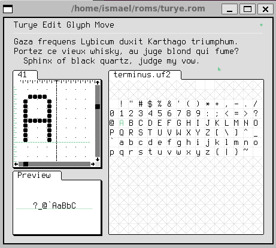

# Terminus Font UF2

## Edit

```bash
$ uxncli turye.rom terminus.uf2
```



## Convert

```bash
$ bin/uf2-to-tal.sh
```

## Info

* [UFX Format](https://wiki.xxiivv.com/site/ufx_format.html)
* [Turye](https://wiki.xxiivv.com/site/turye.html)
