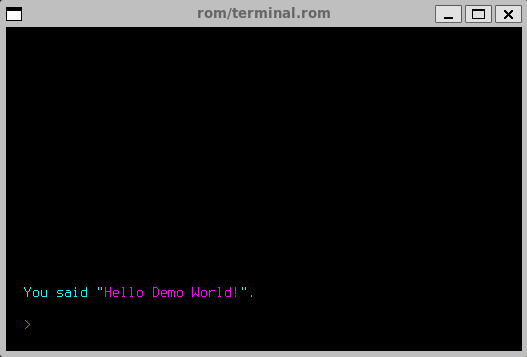

# Terminus Font UF2

## Edit

```bash
$ ./edit.sh
```


## Convert UF2 to Tal

```bash
$ ./build.sh
```

## Test Demo

```bash
$ ./test.sh
```



## Repo

```bash
.
├── LICENSE.md
├── README.md
├── bin
│   ├── terminal.rom
│   ├── terminal.rom.sym
│   └── turye.rom
├── build.sh
├── edit.sh
├── etc
│   ├── terminal.png
│   ├── terminal.tal
│   └── turye-terminus.png
├── terminus.tal
├── terminus.uf2
└── test.sh
```

## Info

* [UFX Format](https://wiki.xxiivv.com/site/ufx_format.html)
* [Turye](https://wiki.xxiivv.com/site/turye.html)
