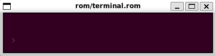
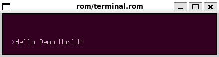
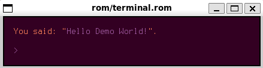

# Terminus Font UF2

## Edit

```bash
$ bin/edit.sh
```


## Convert UF2 to Tal

```bash
$ bin/build.sh
```

## Test Demo

```bash
$ bin/test.sh
```





## Repo

```bash
.
├── LICENSE.md
├── README.md
├── bin
│   ├── build.sh
│   ├── edit.sh
│   └── test.sh
├── etc
│   ├── demo0.png
│   ├── demo1.png
│   ├── demo2.png
│   ├── terminal.tal
│   └── turye-terminus.png
├── rom
│   ├── terminal.rom
│   ├── terminal.rom.sym
│   └── turye.rom
├── terminus.tal
└── terminus.uf2
```

## Info

* [UFX Format](https://wiki.xxiivv.com/site/ufx_format.html)
* [Turye](https://wiki.xxiivv.com/site/turye.html)
